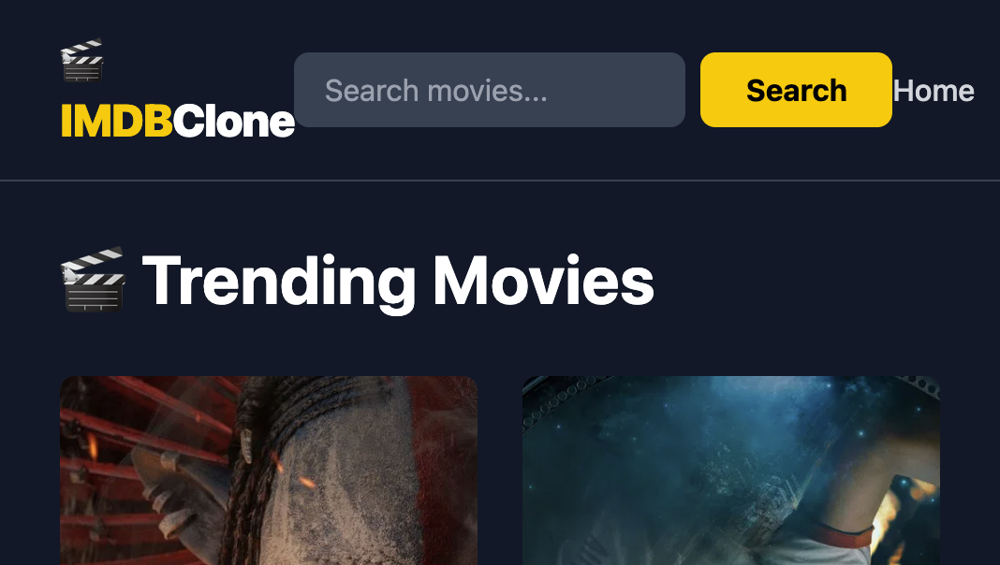
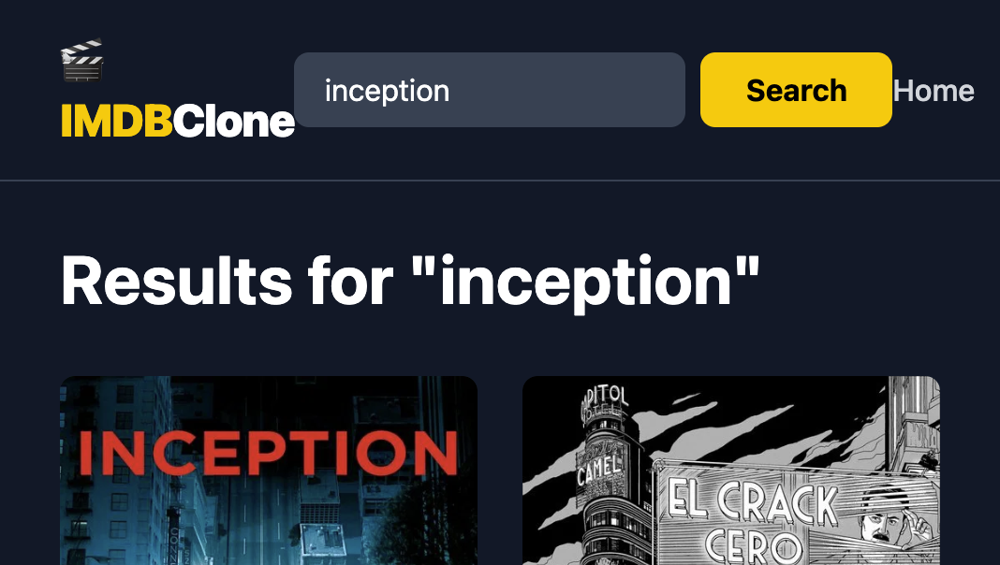
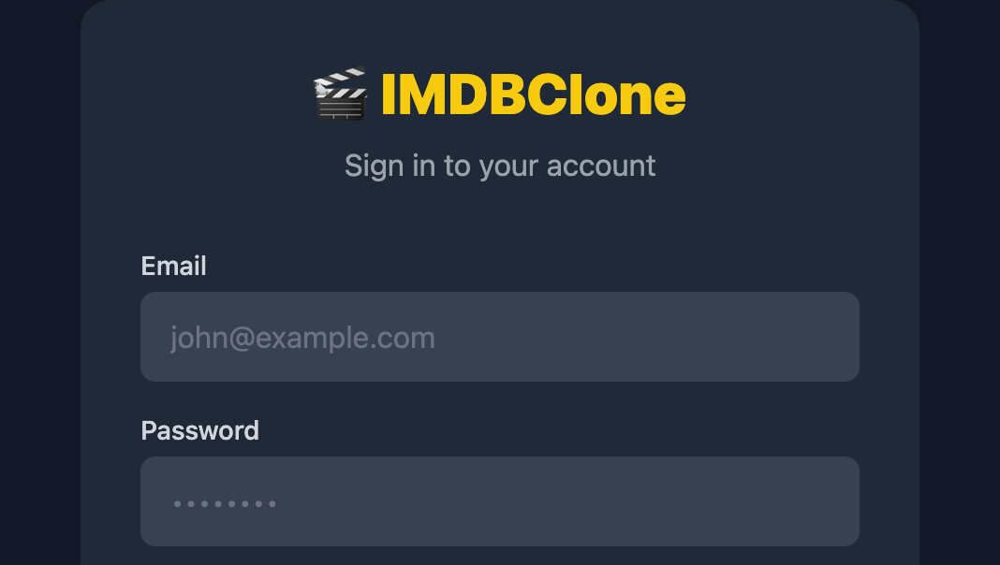

# IMDB Clone (React + TypeScript)

Movie discovery app built with React, TypeScript, Vite, Tailwind, and TMDB API.

## Live Deployment

- Production URL: [https://kunalkachru.github.io/imdb-clone-typescript/](https://kunalkachru.github.io/imdb-clone-typescript/)

## Features

- Browse trending movies from TMDB
- Search movies with URL-synced query state
- View movie details and manage watchlist
- Register/login with mock auth flow
- Protected routes for watchlist
- Per-user watchlist persistence in localStorage

## Tech Stack

- React 19 + React Router 7
- TypeScript 5
- Vite 7 + Tailwind 4
- ESLint 9
- Vitest + Testing Library
- GitHub Actions CI + GitHub Pages deployment

## Local Setup

1. Install dependencies:
   - `npm ci`
2. Create `.env` from `.env-example`.
3. Run the app:
   - `npm run dev`

## Environment Variables

Required:

- `VITE_TMDB_API_KEY`
- `VITE_TMDB_TOKEN`

Optional (defaults provided in CI):

- `VITE_TMDB_BASE_URL` (default: `https://api.themoviedb.org/3`)
- `VITE_TMDB_IMAGE_BASE_URL` (default: `https://image.tmdb.org/t/p`)
- `VITE_BASE_URL` (for GitHub Pages subpath)

Important CI note:

- Local `.env` works for local development/build only.
- GitHub-hosted Actions runners cannot read your local `.env`; they use repository secrets.

## Scripts

- `npm run dev` - start local dev server
- `npm run lint` - run ESLint
- `npm run test` - run tests in watch mode
- `npm run test:run` - run tests once
- `npm run test:coverage` - run tests with coverage
- `npm run build` - type-check and production build
- `npm run preview` - preview production build locally

## CI/CD

- Single workflow: `.github/workflows/deploy.yml`
- Pipeline order:
  1. Lint
  2. Test
  3. Build
  4. Optional local deploy (self-hosted runner + `LOCAL_DEPLOY_PATH` secret)
  5. Cloud deploy to GitHub Pages

## Test Organization

- All tests are centralized under `src/test/` and grouped by layer:
  - `src/test/services/`
  - `src/test/hooks/`
  - `src/test/context/`
  - `src/test/components/`
  - `src/test/pages/`

This is a good practice for teams that want one predictable place for test discovery, review, and CI maintenance.

## UI Screenshots

### Home / Trending

### Search Results

### Movie Detail

### Login

## Documentation

- Detailed docs: `DOCS.md`
